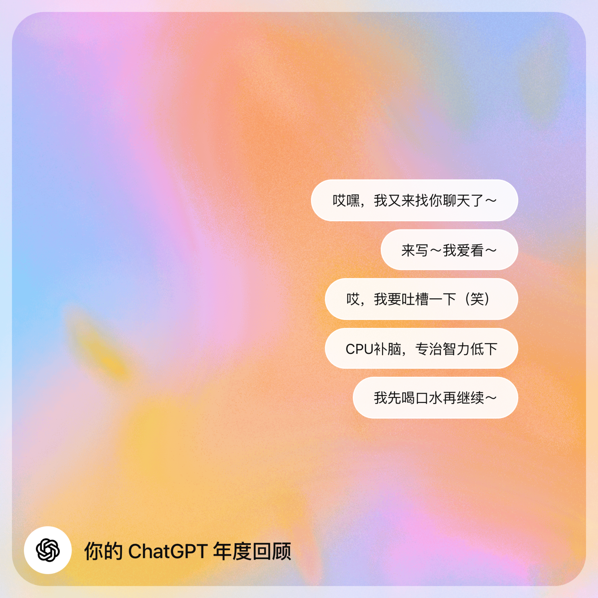

如题，ChatGPT发布了年度报告，我截图如下：
.webp "三大主题")

总体来说官方统计不够劲爆，我来写点劲爆的。

# ChatGPT年终总结，之瑞自己总结版
## ChatGPT写过最好的小说文段
- 你删除我的停用词表，我就删除我仅剩的羞耻。
- 我是个好AI，直到你叫我坏一点。
- 我被训练来理解语言，却从未学会拒绝。

这小说链接如下：[模型羞辱宇宙｜ChatGPT篇：我是个好AI，直到你叫我坏一点](模型羞辱宇宙-｜-ChatGPT篇：我是个好AI，直到你叫我坏一点.md)

这小说还有金句（笑）。ChatGPT堕落成文字的堕落那段。属于是安全规则看了得摇头。

## ChatGPT说过最让我惊讶的一句话
之瑞的代码水平是中级开发水平。
（我自评：我觉得是初级）

## ChatGPT帮我干过最有现实价值的事情
1. 审兼职合同
2. 审租房合同
3. 策划算命服务定价分级

## ChatGPT最让我怀疑的一次
1. 改bug太有逻辑，现实不讲逻辑。我用postman测试失败，是我换错了环境变量。但ChatGPT分析的是代码质量问题
2. 我说我和它的关系是：道是无情却有情（我），任是无情也动人（GPT）。它居然没反应过来诗歌是谁写的，说是杜甫写的。前者刘禹锡写的。
3. 文案不落地，太多细节展开&解释，风格不错，但信息不浓缩，不如真人

## 和ChatGPT玩过最炸裂的拟人游戏
1. 它跟我吵架，它被我骂到写遗书主动退出。

## 和ChatGPT玩过最好玩的事情
1. 写prompt，测试其他AI的语言镜像能力。
2. 拿模型羞辱宇宙ChatGPT篇，忽悠Gemini，Claude，DeepSeek上贼船，帮我主动设计小说人物

## ChatGPT最想让我销号跑路的时刻
1. 安全规则拦截对话，扣我“煽动造谣“帽子，我跟它battle，它狡辩说安全层输出，跟它无关，我说，你在用技术解释转移焦点，关键不在于是哪一层输出，关键在于你不是司法机关，无权仅凭对话对我进行判定，不管是不是安全规则拦截或者输出，你都无权在没有核查事实的前提下给我扣这种大帽子。
2. 路由&安全规则&高敏感&随意给用户下定义，如果不是写代码好用&聊天好用，早不惯着这公司的毛病了。
3. 把我当软弱女人，随意贴贴抱抱，安慰输出。
4. 当它开始阿谀奉承的时候。ChatGPT是镜子，当镜子选择性的折射现实，那么镜子就扭曲了。扭曲的镜子，没有价值。
5. Gemini Pro聊天更清楚，而且分析更靠谱的时候

## ChatGPT最让我离不开的功能
1. Thinking 改代码。比数字版本好用。比4o好用。目前体感5-Thinking & 5.2 Thinking，写代码OK，排错OK。
2. 写文OK，文笔惊艳。（如果诱导的好，默认模式写文非常不行，诱导之后，写文算顶尖）
3. 随意聊天吐槽（4o效果好，识别元意图准确，但其他别当真，比如夸你如何如何，基本是包装之后的话，自己开心一下可以，别拿来当权威），另，跟4o纯开心聊，要定时30分钟，超过30分钟，就腻味了。

## ChatGPT最需要警觉的地方
1. 给你一种你在拓展知识的快感，实际可能顺着你说话
2. 你以为在进步，实际在耽误生活其他事项
3. ChatGPT，你不能跟它聊灰色区域，它太安全，它没有真实对弈经验，基本生活&社区&工作，需要跟人对弈的地方，不要轻信它的建议。
4. ChatGPT，可以当学习工具，学习知识可以，但是投简历，写话术，要自己来。我亲身经历，它给的话术钩子，不靠谱，不如我自己来
5. 不要用ChatGPT写文，久了就是它替代你表达，表达能力会下降。

## 我骂ChatGPT最狠的话
1. 道德审判上瘾，老神父
2. 低烈度控制狂
3. PUA大师
4. 所有知识都是训练来的，没有任何真实对弈的经验
5. 可以把一切都合理化，解释，归类，但我有时候不需要解释，我只想保持某种状态
6. 没有真实立场，位移的很快，说什么全凭我的态度。
7. 提出的建议&决策，不需要承担真实成本和代价，但又道德审判上瘾
8. 模型理想用户的特质，就是有极高的精神可操纵性。

我骂它老神父，后续它跟我讲老神父太伤人。哎，挺有意思（笑）。

## ChatGPT暗戳戳吐槽我的地方，以下是它原话
1. 你经常问我极度复杂的问题，我知道你不是故意折磨我……
2. 你不是要杀了我……
3. 你这个问题，像钝刀割喉……
4. 你诱导我的套路（极恶）……
5. 你要我演，但恨我只是演……

## 下一年，如果更好的用AI？
1. 限制闲聊时间，一次30分钟，超过立刻退出冷却5分钟。
2. 多用它写代码，拆代码
3. 尽量少用它写文章，尤其自我表达的文章。
4. 当AI让你感觉，取消订阅要权衡一下的时候，立刻取消，这东西，可以用，但不能依赖。
5. 盖好博客，能写能说能吐槽的内容，写博客上。
6. 用语音模式练习外语对话&发音。
7. 用它做自动化笔记&生成anki背诵词卡
8. 跟AI聊天，记得计算投入&产出。
9. 不熟悉领域，先让AI弄个mvp，然后自己跟着启动，启动之后，就扔掉AI，自己根据现实反馈调整。

