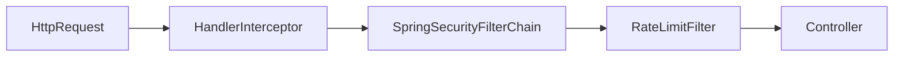

最近登录模块风控链路写完测试，发现新毛病，频控只在code错误时才计数）。
画个图就是：`用户请求发送短信->发送成功->频控不计数`，只有：`验证码错误 -> 频控+1`

这个问题出现，是把风控逻辑混在业务逻辑一起写了。具体写法是：
1. 发短信的时候，不检查手机号是否被风控
2. 登录的时候，检查手机号是否被风控

后续改正：做两套风控系统。
1. 发短信接口频控（目的：防刷/防低成本攻击）
    - 必须在发短信之前执行（成功失败都计数）：
      1. 校验IP频率
      2. 校验设备ID频率
      3. 校验手机号频率
      4. 通过之后调用短信网关
2. 验证码校验错误次数（登录级）
    - `验证码错误 -> 手机号错误次数+1`
    - `超过5次->锁手机号登录`

当手机号被锁的时候，需要同时影响：
- 发短信
- 验证码登录
- 刷新token（如果有）

也就是说：
```Java
if(手机号被锁){
    所有认证相关操作直接拒绝;
}
```

改之后的发短信接口流程是：
1. 请求进来
2. 检查IP是否被锁
3. 检查设备ID是否被锁
4. 检查手机号是否被锁
5. 检查手机号发送频率
6. 检查IP发生频率
7. 全部通过，发送短信
8. 发送成功之后记录频次

验证码登录流程设计：
1. 请求进来
2. 检查手机号是否被锁
3. 校验验证码
   - 正确：清除错误次数
   - 错误：错误次数+1，超过5次，锁手机号30分钟

另写法上需要改进的是，把风控逻辑从业务逻辑里抽出来，做个拦截器。具体写法是：
1. 登录前（IP/设备ID)，用于：登录接口，发送验证码，注册等无需token的接口
2. 登录后（UserId/AccountId/Token来源等），所有需要登录态的业务接口，比如：发帖，评论，下单。

拦截器放哪里？


组件设计：
```Java
LimitKeyBuilder.java;
public class LimitKeyBuilder {
    public static String ipKey(String ip) { return "sms:limit:ip:" + ip; }
    public static String deviceKey(String deviceId) { return "sms:limit:dev:" + deviceId; }
    public static String userKey(Long userId) { return "sms:limit:uid:" + userId; }
}
```

```Java
RateLimitService.java;
public interface RateLimitService {
    boolean isLimited(String key, int threshold, Duration ttl);
}
```
登录前频控拦截器
```Java
public class AnonymousLimitInterceptor extends HandlerInterceptorAdapter {
    @Autowired
    private RateLimitService rateLimitService;

    @Override
    public boolean preHandle(HttpServletRequest request, HttpServletResponse response, Object handler) {
        String ip = getIpAddr(request);
        String devId = request.getHeader("Device-Id");
        if (rateLimitService.isLimited(LimitKeyBuilder.ipKey(ip), 5, Duration.ofMinutes(1)) ||
            rateLimitService.isLimited(LimitKeyBuilder.deviceKey(devId), 5, Duration.ofMinutes(1))) {
            response.setStatus(429);
            response.getWriter().write("Too Many Requests");
            return false;
        }
        return true;
    }
}
```
登录阶段限流，走OncePerRequestFilter
```Java
public class RateLimitFilter extends OncePerRequestFilter {
    @Autowired
    private RateLimitService rateLimitService;

    @Override
    protected void doFilterInternal(HttpServletRequest request, HttpServletResponse response, FilterChain filterChain)
            throws ServletException, IOException {

        Authentication auth = SecurityContextHolder.getContext().getAuthentication();
        if (auth != null && auth.isAuthenticated() && auth.getPrincipal() instanceof CustomUserDetails user) {
            Long userId = user.getId();
            if (rateLimitService.isLimited(LimitKeyBuilder.userKey(userId), 10, Duration.ofMinutes(1))) {
                response.setStatus(429);
                response.getWriter().write("Too Many Requests");
                return;
            }
        }

        filterChain.doFilter(request, response);
    }
}

```


